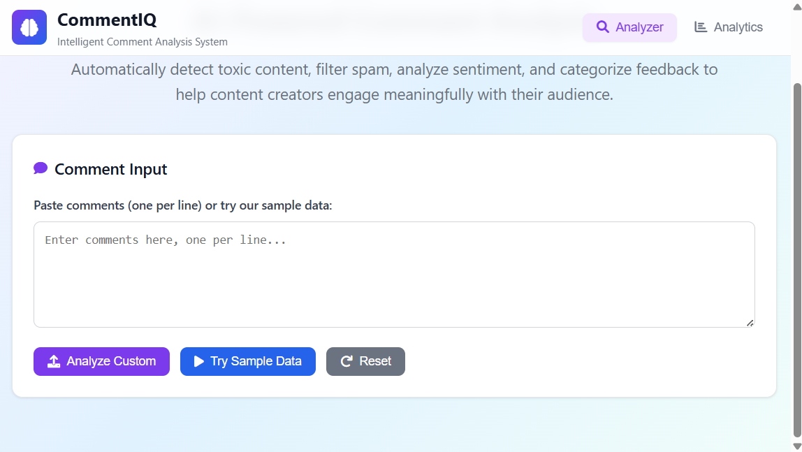
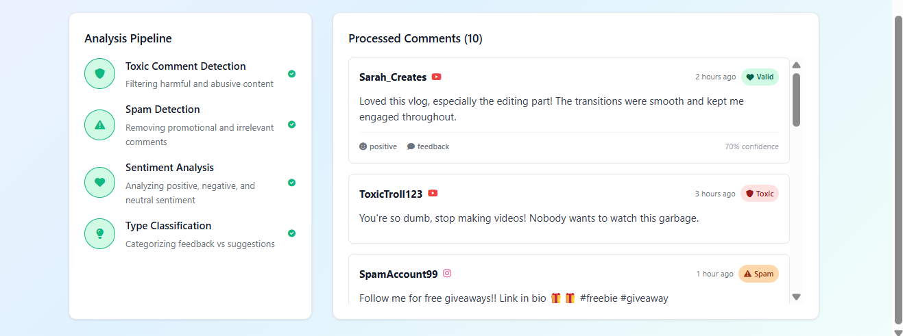
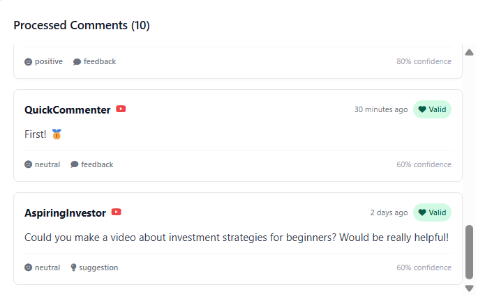

# 💬 CommentIQ: Intelligent Comment Analysis System

CommentIQ is a smart web-based tool designed to **automatically analyze and filter social media comments**. It helps creators and moderators manage comment sections by detecting:

- 🧠 Toxic/abusive content
- 🚫 Spam and promotions
- 📊 Sentiment (positive, neutral, negative)
- 🧩 Type classification (feedback vs suggestions)

---

## 🔍 Features

✅ **Toxic Comment Detection** – Filters out hateful and harmful language  
✅ **Spam Detection** – Flags promotional or irrelevant content  
✅ **Sentiment Analysis** – Classifies emotional tone (positive/negative/neutral)  
✅ **Type Classification** – Differentiates between general feedback and actionable suggestions  
✅ **Confidence Scores** – Each classification comes with a model-generated confidence score  
✅ **YouTube/Instagram Support** – Works for multiple platforms

---

📸 UI Screenshots

## 📸 UI Snapshots

### 🔹 1. Analysis Pipeline

### 🔹 2. Comment Input Interface

### 🔹 3. Processed Comments View

🙋‍♂️ Author

Developed and maintained by Dyutiman Bharadwaj

